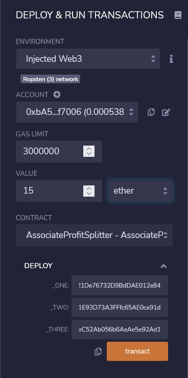
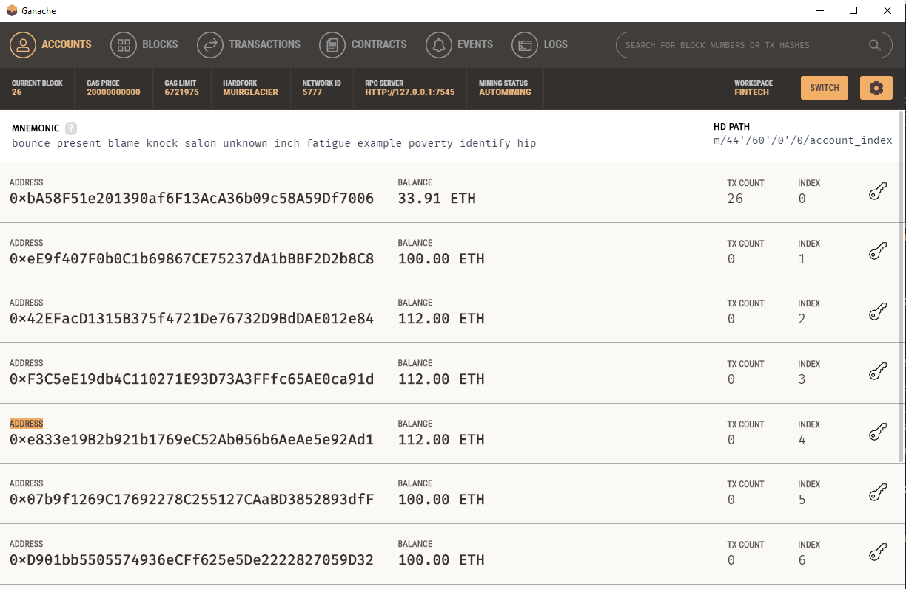
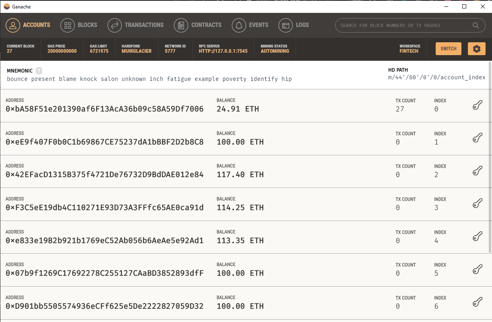

# Description
## AssociateProfitSplitter contract

The AssociateProfitSplitter contract takes Ether into the contract and divides the Ether evenly among the associate level employees. This will allow the Human Resources department to pay employees quickly and efficiently.

## TieredProfitSplitter contract

In this contract, rather than splitting the profits evenly between Associate-level employees, you will calculate rudimentary percentages for different tiers of employees (CEO, CTO, and Bob). In this case we will allocate the pay 60%,25%,15%. 

 
